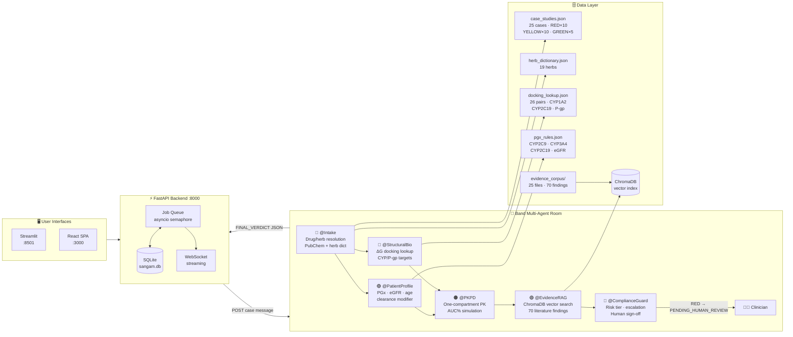

<div align="center">


<br/>

[](https://github.com/nsdeshmukh306-ai/sangam-band/actions/workflows/ci.yml)
[](https://github.com/nsdeshmukh306-ai/sangam-band/releases/tag/v1.0.0)
[](LICENSE)
[](https://www.python.org/)
[](tests/)
[](https://www.deepseek.com/)
[](https://band.ai)
[](https://lablab.ai)

<br/>

> **"Sangam"** (Sanskrit: *confluence*) — A council of 6 specialist AI agents that deliberate together to catch dangerous drug-herb interactions before they reach a patient.

</div>

---

## Why This Exists

<table>
<tr>
<td width="50%">

### 🚨 The Hidden Crisis

India has the **world's highest rate** of concurrent allopathic + Ayurvedic drug use.

**Up to 70% of Indian patients** don't tell their doctor they're also taking herbal supplements.

The result: interactions like **Warfarin + Guggulu** (fatal bleeding risk) or **Tacrolimus + St. John's Wort** (organ rejection) go undetected every single day.

</td>
<td width="50%">

### ✅ What Sangam Does

A **6-agent AI council** reviews any combination of allopathic + Ayurvedic medicines and returns:

- 🔴 **RED** — Contraindicated, human sign-off required
- 🟡 **YELLOW** — Monitor closely
- 🟢 **GREEN** — No significant interaction

With mechanism, AUC change estimate, evidence citations, and confidence score — in real time.

</td>
</tr>
</table>

---

## Meet the Council

*Six agents, each a specialist. They talk to each other so you don't have to guess.*

| Agent | Role | What It Does |
|-------|------|--------------|
| 🔵 **@Intake** | Drug & Herb Resolver | Normalises medicine names via PubChem + herb dictionary |
| 🟣 **@PatientProfile** | Pharmacogenomics | Adjusts for CYP genotype, eGFR, age-based clearance |
| 🩵 **@StructuralBio** | Molecular Docking | Looks up ΔG binding, CYP/P-gp target inhibition |
| 🟠 **@PKPD** | PK/PD Simulator | One-compartment model → AUC % change estimate |
| 🟢 **@EvidenceRAG** | Literature Search | Searches 70 curated findings in a ChromaDB vector index |
| 🔴 **@ComplianceGuard** | Safety Arbiter | Issues final RED/YELLOW/GREEN verdict + escalation |

> Each agent runs as an independent Python process connected via the **Band multi-agent SDK**. They pass structured messages through a shared room — no monolithic prompt, no hallucinated reasoning chain.

---

## Architecture



---

## Quick Start

<details>
<summary><b>📋 Prerequisites</b></summary>

<br/>

- Python **3.11+** with [`uv`](https://docs.astral.sh/uv/) — `pip install uv`
- Node.js **20+** (for React frontend only)
- A Band account with 6 registered External Agents — see `PROJECT_SPEC.md §7` for setup

</details>

<details open>
<summary><b>🚀 Run in 5 steps</b></summary>

<br/>

```bash
# 1. Install Python deps
uv sync

# 2. Configure secrets
cp .env.example .env                            # fill DEEPSEEK_API_KEY, BAND_ROOM_ID
cp agent_config.example.yaml agent_config.yaml  # fill 6 agent IDs + keys

# 3. Build the evidence vector index (one-time)
uv run python -m rag.build_index

# 4. Start all 6 agents + the API backend
bash scripts/start_agents.sh    # agents log to logs/
bash scripts/start_backend.sh   # FastAPI on :8000

# 5. Open a UI
uv run streamlit run frontend/app.py  # :8501 — Streamlit with PK chart
# OR
bash scripts/start_react.sh           # :3000 — React SPA with live WebSocket feed
```

</details>

<details>
<summary><b>🐳 Docker (one command)</b></summary>

<br/>

```bash
cp .env.example .env      # fill in secrets
docker compose up --build
# React SPA  →  http://localhost:3000
# API docs   →  http://localhost:8000/docs
```

</details>

<details>
<summary><b>⌨️ Run a case from the CLI</b></summary>

<br/>

```bash
# By case ID
uv run python -m orchestrator.run_case --case case_1_warfarin_guggulu

# Via REST API
curl -s -X POST http://localhost:8000/api/cases/run \
  -H "Content-Type: application/json" \
  -d '{"case_id":"case_1_warfarin_guggulu"}' | python3 -m json.tool
```

</details>

---

## 25 Validated Drug-Herb Case Studies

> All 25 cases have pre-computed verdicts and pass the full data integrity test suite.

<details open>
<summary><b>🔴 RED — Contraindicated · 10 cases</b></summary>

<br/>

| # | Drug | Herb | Key Mechanism |
|---|------|------|---------------|
| 1 | Warfarin 5 mg | Guggulu | CYP2C9 inhibition → ↑INR → bleeding risk |
| 2 | Digoxin 0.25 mg | Licorice | P-gp inhibition + hypokalemia |
| 4 | Tacrolimus 2 mg | St. John's Wort | CYP3A4 induction → organ rejection risk |
| 7 | Atorvastatin 40 mg | Brahmi | CYP3A4 inhibition → myopathy |
| 9 | Methotrexate 15 mg | Neem | P-gp inhibition + hepatotoxicity |
| 13 | Phenytoin 200 mg | Shankhpushpi | CYP2C9 induction → breakthrough seizures |
| 17 | Rifampicin 600 mg | Turmeric | CYP3A4 inhibition + additive hepatotoxicity |
| 21 | Prednisolone 10 mg | Licorice | CYP3A4 + 11β-HSD2 inhibition |
| 22 | Cyclosporine 150 mg | St. John's Wort | CYP3A4 induction (FDA/EMA contraindicated) |
| 24 | Amiodarone 200 mg | Fenugreek | QT prolongation + CYP3A4 inhibition |

</details>

<details>
<summary><b>🟡 YELLOW — Monitor Closely · 10 cases</b></summary>

<br/>

| # | Drug | Herb | Key Mechanism |
|---|------|------|---------------|
| 3 | Metformin 500 mg | Karela | Additive glucose lowering |
| 6 | Aspirin 75 mg | Ashwagandha | COX-1 + CYP2C9 inhibition, additive bleed |
| 8 | Amlodipine 5 mg | Arjuna | Additive Ca²⁺-channel antagonism |
| 10 | Ciprofloxacin 500 mg | Licorice | CYP1A2 inhibition + QT risk |
| 11 | Omeprazole 20 mg | Black Pepper | CYP2C19 inhibition (piperine) |
| 12 | Insulin Glargine 10 IU | Fenugreek | Additive hypoglycaemia |
| 16 | Lithium 450 mg | Dandelion | Natriuresis → Li⁺ accumulation |
| 18 | Clopidogrel 75 mg | Ginger | Additive antiplatelet (6-gingerol) |
| 19 | Sildenafil 50 mg | Ginkgo biloba | CYP3A4 + additive vasodilation |
| 20 | Clonazepam 1 mg | Valerian | GABA-A potentiation → CNS depression |

</details>

<details>
<summary><b>🟢 GREEN — No Significant Interaction · 5 cases</b></summary>

<br/>

| # | Drug | Herb | Reason |
|---|------|------|--------|
| 5 | Paracetamol 500 mg | Tulsi | No clinically significant interaction |
| 14 | Amoxicillin 500 mg | Garlic (culinary) | No significant PK interaction |
| 15 | Levothyroxine 100 mcg | Shatavari | Theoretical only, no published data |
| 23 | Furosemide 40 mg | Dandelion | Negligible additive diuresis |
| 25 | Cetirizine 10 mg | Ashwagandha | No CYP interaction (renal elimination) |

</details>

---

## API Reference

| Method | Path | Description |
|--------|------|-------------|
| `POST` | `/api/cases/run` | Enqueue an analysis job |
| `GET` | `/api/cases/{job_id}/status` | Poll job status + full verdict |
| `GET` | `/api/cases/list` | List all 25 case study metadata |
| `GET` | `/api/jobs` | Recent job history |
| `GET` | `/api/room/transcript` | Live Band room transcript |
| `WS` | `/api/ws/{job_id}` | Stream agent events in real time |
| `GET` | `/health` | Liveness + Band room accessibility |

---

## Repository Layout

```
sangam-band/
│
├── agents/                      # One Python process per Band agent
│   ├── common/                  # Shared tools: pkpd.py, rag.py, pubchem client
│   ├── intake_agent.py          # 🔵 @Intake — drug/herb resolution
│   ├── patient_profile_agent.py # 🟣 @PatientProfile — PGx + eGFR
│   ├── structural_agent.py      # 🩵 @StructuralBio — docking lookup
│   ├── pkpd_agent.py            # 🟠 @PKPD — AUC simulation
│   ├── evidence_rag_agent.py    # 🟢 @EvidenceRAG — ChromaDB search
│   └── compliance_agent.py      # 🔴 @ComplianceGuard — verdict + escalation
│
├── backend/                     # FastAPI + aiosqlite + asyncio job queue
├── frontend/
│   ├── app.py                   # Streamlit UI (3 tabs + Plotly PK chart)
│   └── react/                   # Vite + React 18 + TypeScript + WebSocket
│
├── data/
│   ├── case_studies.json        # 25 cases with pre-computed verdicts
│   ├── herb_dictionary.json     # 19 Ayurvedic herbs + CYP/P-gp flags
│   ├── docking_lookup.json      # 26 drug-herb pairs, ΔG values
│   ├── pgx_rules.json           # CYP2C9/3A4/2C19 + eGFR rules
│   └── evidence_corpus/         # 25 literature files → 70 RAG findings
│
├── deployment/                  # GCP Cloud Run + Cloud Build configs
├── orchestrator/                # Band REST client + CLI runner
├── rag/                         # ChromaDB index builder
├── scripts/                     # Agent launcher, backend launcher, watchdog
└── tests/                       # 44 tests — all run without live credentials
```

---

## Tech Stack

| Layer | Technology |
|-------|-----------|
| Agent platform | [Band](https://band.ai) multi-agent SDK (LangGraph adapter) |
| LLM | DeepSeek-V3 (OpenAI-compatible API) |
| Backend | FastAPI + aiosqlite + asyncio job queue |
| Frontend | React 18 + Vite + TypeScript (WebSocket streaming) |
| Streamlit UI | Streamlit + Plotly (PK curve visualisation) |
| RAG | ChromaDB vector index (70 evidence findings) |
| Containerisation | Docker multi-stage + docker-compose |
| CI/CD | GitHub Actions + GCP Cloud Build |
| Testing | pytest — 44 tests, zero live credentials needed |

---

## Running Tests

```bash
uv run pytest tests/ -v --tb=short
# Covers: PGx rules · docking lookup · herb dict · PubChem client
#         PK/PD math · RAG pipeline · 25-case data integrity
# 44 tests — all green, no API keys required
```

---

<div align="center">

**Built for the [lablab.ai Band of Agents Hackathon](https://lablab.ai) · Track 3: Regulated & High-Stakes Workflows**

[](LICENSE)
[]()

*"The best drug interaction checker is one that catches what humans miss."*

</div>
