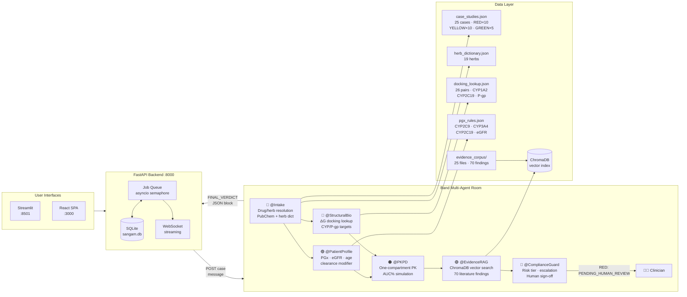

# Sangam — Polypharmacy Safety Council

> **Track 3 · Regulated & High-Stakes Workflows** | Band of Agents Hackathon (lablab.ai)

"Sangam" (Sanskrit: confluence) is a **6-agent Band multi-agent system** that reviews a
patient's combined allopathic + Ayurvedic medication list and produces a clinician-reviewable
drug-herb interaction safety verdict in real time.

---

## The Problem

India has the world's highest rate of concurrent allopathic + Ayurvedic drug use.  
Up to **70 % of Indian patients** do not disclose herbal supplement use to their physicians.  
Serious interactions (warfarin + guggulu, cyclosporine + St. John's Wort, phenytoin + shankhpushpi)
are **routinely missed**, causing preventable adverse events.

## Our Solution

A council of 6 specialist AI agents — each with a distinct clinical role — deliberates in a
shared Band room, then issues a structured safety verdict with a traffic-light tier
(RED / YELLOW / GREEN), confidence score, AUC change estimate, mechanism explanation,
evidence citations, and a mandatory human sign-off request for RED findings.

---

## Architecture



---

## 25 Drug-Herb Case Studies

| # | Drug | Herb | Tier | Key Mechanism |
|---|------|------|------|---------------|
| 1 | Warfarin 5 mg | Guggulu | 🔴 RED | CYP2C9 inhibition → ↑INR → bleeding |
| 2 | Digoxin 0.25 mg | Licorice | 🔴 RED | P-gp inhibition + hypokalemia |
| 3 | Metformin 500 mg | Karela | 🟡 YELLOW | Additive glucose lowering |
| 4 | Tacrolimus 2 mg | St. John's Wort | 🔴 RED | CYP3A4 induction → rejection risk |
| 5 | Paracetamol 500 mg | Tulsi | 🟢 GREEN | No clinically significant interaction |
| 6 | Aspirin 75 mg | Ashwagandha | 🟡 YELLOW | COX-1 + CYP2C9 inhibition, additive bleed |
| 7 | Atorvastatin 40 mg | Brahmi | 🔴 RED | CYP3A4 inhibition → myopathy risk |
| 8 | Amlodipine 5 mg | Arjuna | 🟡 YELLOW | Additive Ca²⁺-channel antagonism |
| 9 | Methotrexate 15 mg | Neem | 🔴 RED | P-gp inhibition + hepatotoxicity |
| 10 | Ciprofloxacin 500 mg | Licorice | 🟡 YELLOW | CYP1A2 inhibition + QT risk |
| 11 | Omeprazole 20 mg | Black Pepper | 🟡 YELLOW | CYP2C19 inhibition (piperine) |
| 12 | Insulin Glargine 10 IU | Fenugreek | 🟡 YELLOW | Additive hypoglycaemia |
| 13 | Phenytoin 200 mg | Shankhpushpi | 🔴 RED | CYP2C9 induction → breakthrough seizures |
| 14 | Amoxicillin 500 mg | Garlic (culinary) | 🟢 GREEN | No significant PK interaction |
| 15 | Levothyroxine 100 mcg | Shatavari | 🟢 GREEN | Theoretical only, no published data |
| 16 | Lithium 450 mg | Dandelion | 🟡 YELLOW | Natriuresis → Li⁺ accumulation |
| 17 | Rifampicin 600 mg | Turmeric | 🔴 RED | CYP3A4 inhibition + additive hepatotoxicity |
| 18 | Clopidogrel 75 mg | Ginger | 🟡 YELLOW | Additive antiplatelet (6-gingerol) |
| 19 | Sildenafil 50 mg | Ginkgo biloba | 🟡 YELLOW | CYP3A4 + additive vasodilation |
| 20 | Clonazepam 1 mg | Valerian | 🟡 YELLOW | GABA-A potentiation → CNS depression |
| 21 | Prednisolone 10 mg | Licorice | 🔴 RED | CYP3A4 inhibition + 11β-HSD2 inhibition |
| 22 | Cyclosporine 150 mg | St. John's Wort | 🔴 RED | CYP3A4 induction (FDA/EMA contraindicated) |
| 23 | Furosemide 40 mg | Dandelion | 🟢 GREEN | Negligible additive diuresis |
| 24 | Amiodarone 200 mg | Fenugreek | 🔴 RED | QT prolongation + CYP3A4 inhibition |
| 25 | Cetirizine 10 mg | Ashwagandha | 🟢 GREEN | No CYP interaction (renal elimination) |

**Tier distribution: RED × 10 · YELLOW × 10 · GREEN × 5**

---

## Quick Start

### Prerequisites

- Python 3.11+ with [`uv`](https://docs.astral.sh/uv/)
- Node.js 20+ (for React frontend)
- A Band account with 6 registered External Agents (see `PROJECT_SPEC.md §7`)

### 1 — Install Python dependencies

```bash
uv sync
```

### 2 — Configure secrets

```bash
cp .env.example .env          # fill in DEEPSEEK_API_KEY, BAND_ROOM_ID
cp agent_config.example.yaml agent_config.yaml   # fill in 6 agent IDs + keys
```

### 3 — Build the evidence index (once)

```bash
uv run python -m rag.build_index
```

### 4 — Start agents + backend

```bash
bash scripts/start_agents.sh   # 6 Band agents (nohup, logs in logs/)
bash scripts/start_backend.sh  # FastAPI on :8000
```

### 5 — Start a frontend

```bash
# Option A — Streamlit (original)
uv run streamlit run frontend/app.py

# Option B — React SPA
source ~/.nvm/nvm.sh
bash scripts/start_react.sh    # Vite dev server on :3000
```

### 6 — Run a case

```bash
# CLI
uv run python -m orchestrator.run_case --case case_1_warfarin_guggulu

# REST API
curl -s -X POST http://localhost:8000/api/cases/run \
  -H "Content-Type: application/json" \
  -d '{"case_id":"case_1_warfarin_guggulu"}' | python3 -m json.tool
```

### Docker (local production)

```bash
cp .env.example .env  # fill in secrets
docker compose up --build
# React SPA → http://localhost:3000
# FastAPI docs → http://localhost:8000/docs
```

---

## Repository Layout

```
agents/                 One Python process per Band agent
  common/               Shared tools: pkpd.py, rag.py
  intake_agent.py       @Intake — drug/herb resolution
  patient_profile_agent.py  @PatientProfile — PGx + eGFR
  structural_agent.py   @StructuralBio — docking lookup
  pkpd_agent.py         @PKPD — AUC simulation
  evidence_rag_agent.py @EvidenceRAG — ChromaDB search
  compliance_agent.py   @ComplianceGuard — tier + escalation
backend/                FastAPI async backend (job queue, SQLite, WebSocket)
data/                   Case studies, herb dict, docking, PGx, evidence corpus
deployment/             GCP Cloud Run + Cloud Build configs ([YOUR_GCP_PROJECT] placeholders)
docs/                   Architecture notes, submission assets
frontend/
  app.py                Streamlit frontend (3 tabs)
  react/                Vite + React 18 + TypeScript SPA
orchestrator/           Band REST client + CLI runner
rag/                    ChromaDB index builder
scripts/                Agent launcher, backend launcher, watchdog
tests/                  33 unit tests + 25-case data integrity suite
```

---

## API Reference

| Method | Path | Description |
|--------|------|-------------|
| `POST` | `/api/cases/run` | Enqueue an analysis job |
| `GET` | `/api/cases/{job_id}/status` | Poll job status + verdict |
| `GET` | `/api/cases/list` | List all 25 case study metadata |
| `GET` | `/api/jobs` | Recent job history |
| `GET` | `/api/room/transcript` | Live Band room transcript |
| `WS` | `/api/ws/{job_id}` | Stream job events (status/posted/verdict/done) |
| `GET` | `/health` | Liveness + Band room accessibility |

---

## Running Tests

```bash
uv run pytest tests/ -v --tb=short
# 44 tests: PGx rules, docking, herb dict, PubChem, PK/PD, RAG,
#           25-case data integrity — all run without live credentials
```

---

## Tech Stack

| Layer | Technology |
|-------|-----------|
| Agent platform | [Band](https://band.ai) multi-agent SDK (LangGraph adapter) |
| LLM | DeepSeek-V3 (OpenAI-compatible API) |
| Backend | FastAPI + aiosqlite + asyncio job queue |
| Frontend | React 18 + Vite + TypeScript (WebSocket streaming) |
| Streamlit UI | Streamlit + Plotly (PK curve visualisation) |
| RAG | ChromaDB vector index (70 evidence findings) |
| Containerisation | Docker multi-stage + docker-compose |
| CI/CD | GitHub Actions + GCP Cloud Build (deployment configs) |
| Testing | pytest (44 tests, no live credentials required) |

---

## License

MIT — see [`LICENSE`](LICENSE).
